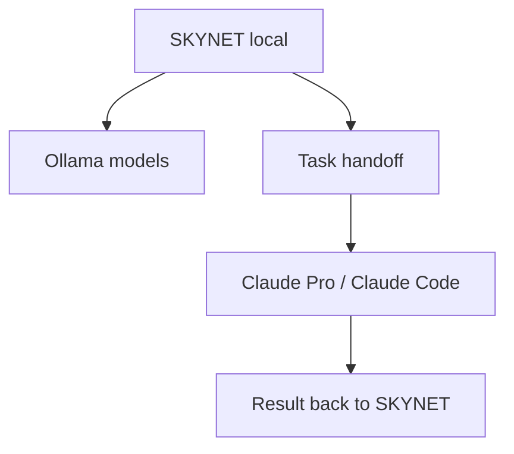

# Claude Pro без платного API

Claude Pro подписка не равна Anthropic API. Для SKYNET это означает:

- нельзя просто поставить `ANTHROPIC_API_KEY`, если API не оплачен отдельно;
- CrewAI не сможет автоматически вызывать Claude через Pro-подписку как API;
- Claude Pro полезен как сильный внешний исполнитель через Claude Web или Claude Code;
- автоматический бесплатный движок SKYNET должен работать через локальные модели.

## Рекомендуемая гибридная схема



## Как использовать на практике

### 1. Постоянный режим SKYNET

```env
SKYNET_MODE=local
LOCAL_DEFAULT_MODEL=ollama/llama3.1:8b
ANTHROPIC_API_KEY=
OPENAI_API_KEY=
```

Так система работает без вложений.

### 2. Для задач кодинга

Используй Claude Code вручную в папке проекта:

```powershell
cd "C:\Users\Влад\Desktop\SKYNET"
claude
```

Дальше передавай ему конкретные задачи:

```text
Проверь src/institute/router.py и предложи минимальный diff.
Не меняй архитектуру, только исправь ошибки.
```

### 3. Для сложных решений

SKYNET формирует план/бриф локально, затем этот бриф можно отдать Claude Pro:

```text
Вот задача, текущая архитектура, ограничения и желаемый результат.
Сделай ревью и предложи правки.
```

После ответа Claude переносишь решение обратно в проект.

## Когда нужен платный API

API нужен только если ты хочешь, чтобы Claude:

- вызывался автоматически внутри CrewAI;
- сам участвовал в цепочке агентов без ручного копирования;
- анализировал изображения в отделе дизайна через vision;
- работал в фоне на сервере.

Без API это заменяется локальными моделями + ручным использованием Claude Pro.

## Итоговая рекомендация

Для твоего бюджета:

1. `SKYNET_MODE=local` — основа без затрат.
2. Ollama `llama3.1:8b` — общий интеллект.
3. Ollama `qwen2.5-coder:7b` или `deepseek-coder:6.7b` — кодинг.
4. Claude Pro/Claude Code — сложные архитектурные и кодовые задачи вручную.
5. API подключать позже, когда система начнёт приносить деньги.
